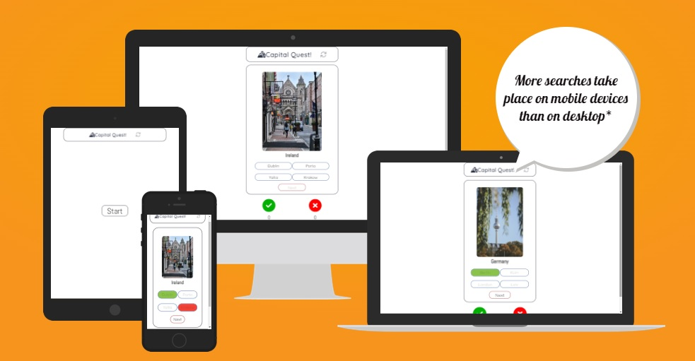
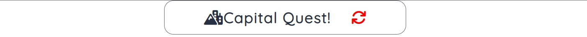
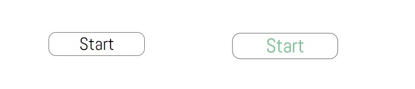

# Capital Quest

Embark on an exciting journey around the globe with "Capital Quest," the ultimate quiz game designed to test your knowledge of world capitals! Whether you're a geography enthusiast, a traveler, or simply curious about the world, this game will challenge and entertain you.
In "Capital Quest," you'll be presented with a series of questions, each focusing on a different country. Your task is to guess the capital city associated with that particular country. To become a winner you'll need to score 5 out of 5, if you got one question wrong you will lose:D

To try it yourself click on this link! [Capital-Quest](https://vitalii-chepurnyi.github.io/quiz-game-capital/)

# Features

<ul>
    <li>Name of The Game and Refresh Button
        <ol>
            <li>Featured at the top of the page, the name of the game Capital Quest.
            <li>To the left of the game name featured an icon that displays a city, to improve understanding the meaning of this game for a user.
            <li>On the right near "Capital Quest" name, an icon is located that functioning as a button to refresh the page(game). When you hover over it, the icon turns red 
            to indicate functionality for a user and to improve better user experiance.
        </ol>
</ul>

<ul>
    <li>Start Button
        <ol>
            <li>Featured in a middle of the screen, a button called "Start".
            <li>The button start created to enroll the game, so every time you restart the game you have to start it again.
            <li>The name for this button is easy to understand and when you hover it, the button expands in size and changes its color to green
            for better user experiance.
        </ol>
</ul>

