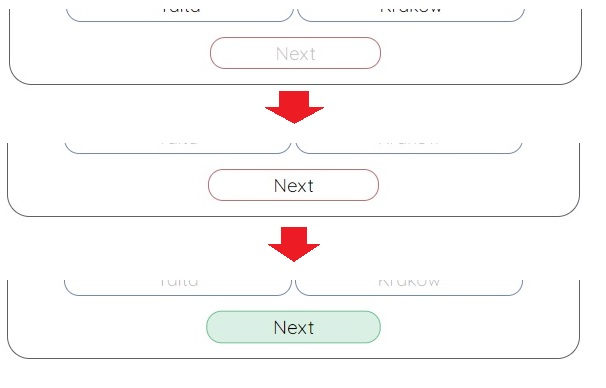
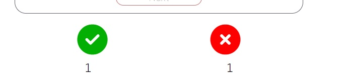
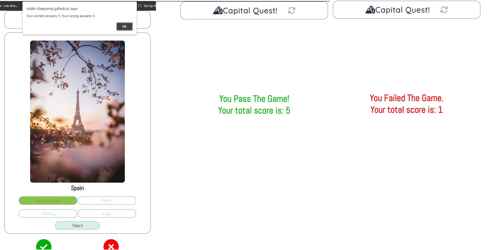
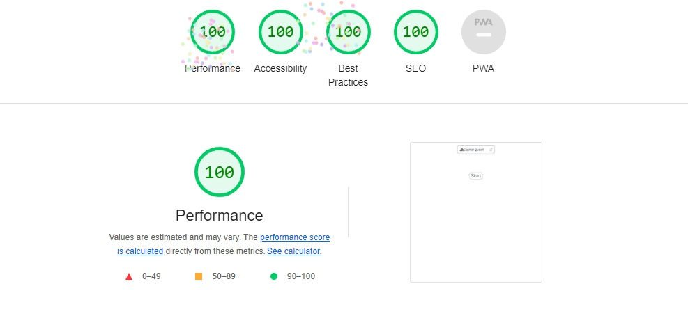

# Capital Quest

Embark on an exciting journey around the globe with "Capital Quest," the ultimate quiz game designed to test your knowledge of world capitals! Whether you're a geography enthusiast, a traveler, or simply curious about the world, this game will challenge and entertain you.
In "Capital Quest," you'll be presented with a series of questions, each focusing on a different country. Your task is to guess the capital city associated with that particular country. To become a winner you'll need to score 5 out of 5, if you got one question wrong you will lose:D

To try it yourself click on this link! [Capital-Quest](https://vitalii-chepurnyi.github.io/quiz-game-capital/)

# Features

<ul>
    <li>Name of The Game and Refresh Button
        <ol>
            <li>Featured at the top of the page, the name of the game Capital Quest.
            <li>To the left of the game name featured an icon that displays a city, to improve understanding the meaning of this game for a user.
            <li>On the right near "Capital Quest" name, an icon is located that functioning as a button to refresh the page(game). When you hover over it, the icon turns red 
            to indicate functionality for a user and to improve better user experiance.
        </ol>
</ul>

<ul>
    <li>Start Button
        <ol>
            <li>Featured in a middle of the screen, a button called "Start".
            <li>The button start created to enroll the game, so every time you restart the game you have to start it again.
            <li>The name for this button is easy to understand and when you hover it, the button expands in size and changes its color to green
            for better user experiance.
        </ol>
</ul>

<ul>
    <li>Main Game Content
        <ol>
            <li>Featured in a center of the screen.
            <li>After you press start button the main game content will appeare.
            <li>The content includes images, questions, answers, next button, and score.
        </ol>
</ul>

<ul>
    <li>Country Image
        <ol>
            <li>Featured on top, inside the main game content.
            <li>These images relate directly to the country.
            <li>It is done to improve game quality, make it more interactive and to improve overall understanding of the game.
            <li>When you hover over the image, it expands to help the user get a better look at it.
            <li>This feature includes 5 different images.
            <li>Every next game the image changes, related to the question.
        </ol>
</ul>

<ul>
    <li>Question Section
        <ol>
            <li>It is located right underneath the country images.
            <li>It changes every time you answer a question that is provided there.
            <li>It includes a list of questions for the game user like "Ireland", "Germany", "France", "Poland", "Spain".
            <li>When you press start button, the main question appears randomly every time, along with the images and answers.
        </ol>
</ul>

<ul>
    <li>Answer Section
        <ol>
            <li>Located inside main content underneath question section.
            <li>The answer section includes four answers.
            <li>Each answer is created as a button.
            <li>Also changes every quiz game related to the question.
            <li>When you press on any answer, it automatically checks the answer related to the question.
            <li>If you got it right the button will glow in green, if you got it wrong it will glow in red.
            <li>There is a second feature too, when you pick a wrong answer it will show correct answer and your wrong answer, 
            so it will help the user memorize the correct answer for next time.
            <li>At the time when you choose your answer, the buttons will disable so you won't be able to rechoose your answer, it prevents of cheating.
            <li>When you hover over the button it will change it color to light blue, to make it more responsive.
        </ol>
</ul>

<ul>
    <li>Next Button
        <ol>
            <li>Located underneath answer section.
            <li>Created as a button.
            <li>The purpose of this button, is that when you choose your answer you can press next button and the following game will appeare.
            <li>But while you choosing your answer you won't be able to click next button, to prevent skiping the game to the end.
            <li>Only when you decided on your answer the button will be clickable to skip to the next game.
            <li>When you hover over it, the color will change to green, to make it more understandable and more responsive for the user.
        </ol>
</ul>

<ul>
    <li>Score Section
        <ol>
            <li>Located underneath main game content.
            <li>Two icons were created to represets "right" and "wrong" score.
            <li>Underneath icons two "span" element were created to hold current user score.
            <li>Every game that user answer "right" or "wrong" the score increase by one.
            <li>This feature is created to help user keep track of his answered questions, and understand how many correct or wrong answers he/she got.
        </ol>
</ul>

<ul>
    <li>Final Result Section
        <ol>
            <li>At the end of the game, you will get alerted about your final score of the game, at the top of the screen.
            <li>After you pressed "okay", final result section will appeare.
            <li>If you win you will recive this message:
            "You Pass The Game! Your total score is: 5" this is done to congratulate the user, and show the final score he/she got.
            <li>If you lose you will recive this message:
            "You Failed The Game. Your total score is: 0" this is done to notify the user of his failed game, and show the total right score he/she got.
            <li>To restart the game again, user will need to refresh the game by using refresh button provided at the top of the screen.
            <li>When the game is refreshed you have to play from the start every time.
        </ol>
</ul>

# Testing

<ul>
   <li>The website was viewed on all devices, including a desktop, laptop, tablet, and a few iPhone models.
   <li>This website has been viewed and tested on Google Chrome, Opera, Mozilla Firefox, Safari and Microsoft Edge.
   <li>Household members and friends were asked to navigate through the website and identify any bugs or improvements to be made.
</ul>    

# Lighthouse Testing

